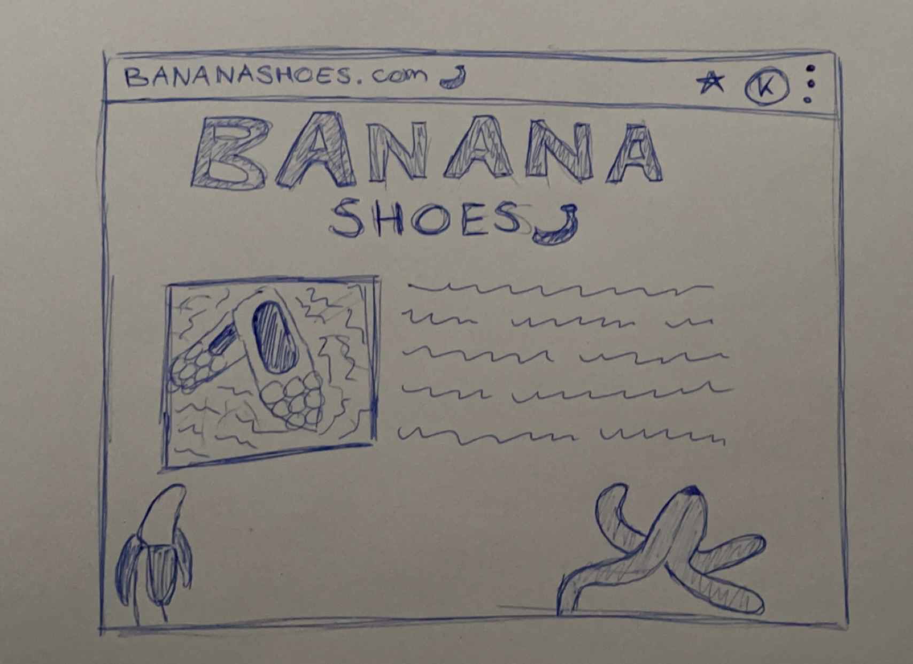

# Banana Shoes Website

## Wireframes

## Quellen Verzeichnis

https://openai.com/product/dall-e-2
> src/images/dall-e/*

https://www.pinterest.com/pin/89720217565550668/
> src/images/spinningBanana.gif

https://es.pixilart.com/art/pb-j-time-banana-gif-e786404ae86a167
> src/images/dancingBanana.gif

## Selbstevaluation

Technisch:
Technisch verlief das Projekt reibungslos. Wir konnten die Anforderungen erfüllen und somit unser Ziel erreichen, eine
over-the-top React-App mit Animationen zu entwickeln.

Teamarbeit:
In Bezug auf die Zusammenarbeit im Team gab es keine Probleme. Wir haben gut zusammengearbeitet und uns gegenseitig
unterstützt, wenn es notwendig war. Wir haben uns aufeinander verlassen können und haben uns während des Projekts gut
ergänzt.

Zeitmanagement:
Leider haben wir uns bei der Planung des Projekts ein wenig verschätzt und waren nicht in der Lage, rechtzeitig fertig
zu werden. Dadurch mussten wir unsere Freizeit ein wenig opfern, um das Projekt fertigzustellen. In Zukunft müssen wir uns besser
organisieren und realistischere Zeitpläne erstellen.

Verbesserungspotential:
Wir haben erkannt, dass wir in Zukunft eine bessere Projekt- und Zeitplanung benötigen, um ähnliche Probleme in Zukunft
zu vermeiden. Wir sollten uns frühzeitig Gedanken darüber machen, welche Aufgaben zu erledigen sind und wie viel Zeit
wir benötigen, um diese Aufgaben zu erledigen.

Erlerntes:
Während des Projekts haben wir viel über Animationen und den Umgang mit diesen in einer React-App gelernt. Wir haben
unser Wissen in diesem Bereich erweitert und sind in der Lage, dieses auch anzuwenden.

Arbeitsteilung:
Die Arbeitsteilung war nicht strikt geregelt, sondern wurde durch Absprachen im Team bestimmt. Dies hat gut funktioniert
und hat uns die Flexibilität gegeben, unsere Stärken optimal einzusetzen.

Notenvorschlag:
In Anbetracht der erfolgreichen technischen Umsetzung, der guten Teamarbeit und der erworbenen Fähigkeiten würde ich uns
die Note 5 geben.